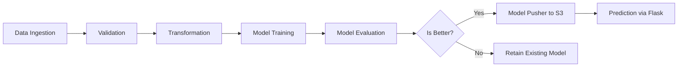

# 🚗 MLOps Project - Vehicle Insurance Data Pipeline

Hi! This is my MLOps project where I built a **production-ready pipeline** to manage and deploy a vehicle insurance prediction model. This project is designed not just to build a model, but to **take it to production the right way**—with CI/CD, cloud storage, containerization, and proper modular architecture. Let’s walk through everything I implemented!

---

## 📁 Project Setup and Structure

### 1. Project Template
- I started by executing the `template.py` script which auto-generated the project structure and boilerplate files.

### 2. Package Management
- I set up local package imports using `setup.py` and `pyproject.toml`.
- For a quick intro to those files, see `projectnotes.txt`.

### 3. Virtual Environment & Dependencies
```bash
conda create -n vehicle python=3.10 -y
conda activate vehicle
pip install -r requirements.txt
pip list  # to verify
```

---

## ☁️ MongoDB Atlas Integration

### 4. MongoDB Configuration
- Created a MongoDB Atlas project
- Set up a free M0 cluster and added DB user and IP whitelist (`0.0.0.0/0`)
- Retrieved the Python driver connection string

### 5. Upload Dataset
- Created a `notebook/` folder and added `mongoDB_demo.ipynb`
- Pushed dataset to MongoDB from the notebook
- Verified data on MongoDB Atlas dashboard

---

## 🧩 Logging, Exception Handling & EDA

### 6. Logging & Exception Utilities
- Built custom logging and exception modules and tested them on `demo.py`

### 7. EDA & Feature Engineering
- Performed detailed analysis and transformation ideas in a Jupyter notebook

---

## 📥 Data Ingestion Pipeline

### 8. Ingestion Component
- Set MongoDB connection in `mongo_db_connection.py`
- Developed data fetching logic in `proj1_data.py` under `data_access`
- Updated `config_entity.py` and `artifact_entity.py` with ingestion entities
- Created `data_ingestion.py` in `components/` and tested via `demo.py`

### 9. MongoDB URL Environment Variable
```bash
# Bash
export MONGODB_URL="mongodb+srv://<username>:<password>@..."
# PowerShell
$env:MONGODB_URL="mongodb+srv://<username>:<password>@..."
```

---

## ✅ Data Validation, Transformation & Training

### 10. Data Validation
- Defined schema in `config/schema.yaml`
- Wrote column/data checks in `utils/main_utils.py` and `data_validation.py`

### 11. Data Transformation
- Implemented transformation logic in `data_transformation.py`
- Created reusable pipeline and saved it for inference

### 12. Model Training
- Built model trainer logic inside `model_trainer.py`
- Used `estimator.py` to manage training and evaluation functions

---

## 🌍 AWS Integration

### 13. AWS Setup
- Created IAM user, generated keys, and exported them as env variables:
```bash
export AWS_ACCESS_KEY_ID=...
export AWS_SECRET_ACCESS_KEY=...
```
- Added access keys to `constants/__init__.py`
- Created S3 bucket: `my-model-mlopsproj` (Region: `us-east-1`)

### 14. S3 Connection Code
- Added `aws_connection.py` and `s3_estimator.py` to handle push/pull logic

---

## 🚀 Model Evaluation & Deployment

### 15. Model Evaluation
- Compared current model with previous model from S3
- Promoted model if performance improved (threshold: 0.02)

### 16. Model Pusher
- Saved accepted model to:
  - Local `saved_models/` folder
  - S3 model registry

---

## 🧪 Prediction Pipeline & Flask App

### 17. Prediction Logic
- Built `/` and `/train` routes in `app.py`
- Integrated trained model and preprocessing pipeline

### 18. UI Directories
- Added `static/` and `templates/` folders for HTML interface

---

## 🔄 CI/CD: GitHub Actions + Docker + EC2

### 19. Docker Setup
- Wrote `Dockerfile` and `.dockerignore`
- Configured GitHub Actions workflow in `.github/workflows/aws.yaml`

### 20. GitHub Secrets
- Added:
  - `AWS_ACCESS_KEY_ID`
  - `AWS_SECRET_ACCESS_KEY`
  - `AWS_DEFAULT_REGION`
  - `ECR_REPO`

### 21. EC2 & ECR Setup
- Launched EC2 instance (Ubuntu 24.04, t2.medium)
- Installed Docker and registered GitHub runner

### 22. Port Configuration
- Opened EC2 port 5080 in security group
- Accessed app at: `http://<EC2-Public-IP>:5080`

---

## 🧠 Project Pipeline Summary



---

## 💡 Tech Stack Used

- Python, Pandas, Scikit-learn, MongoDB Atlas
- Flask, Docker, GitHub Actions, AWS (EC2, S3, ECR, IAM)
- Conda, pyproject.toml, setup.py

---

## 🙌 Final Thoughts

This project taught me not just how to build models, but how to **operationalize** them.  
From clean ingestion to real-time predictions and auto-deployments — everything is built with scalability in mind.

---

📫 Feel free to connect with me if you want to collaborate or have any questions about the pipeline!
