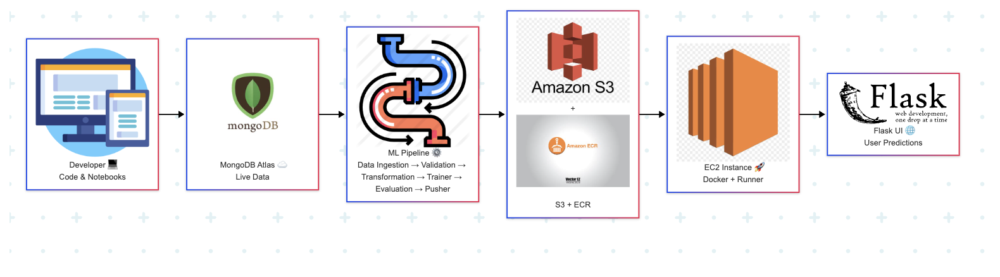
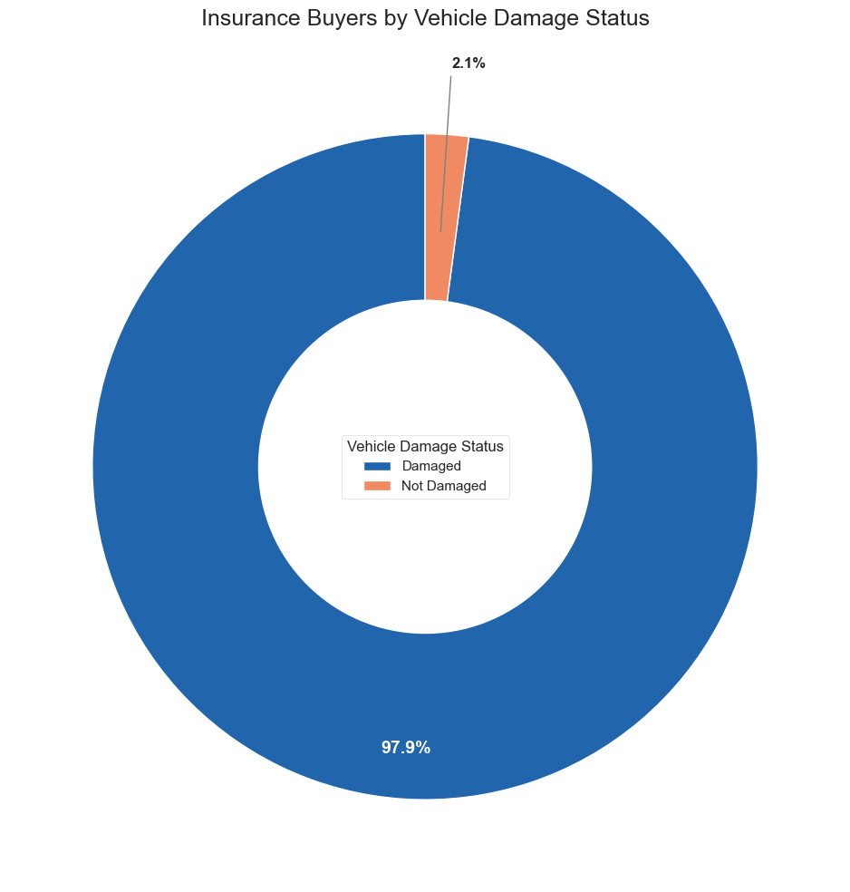
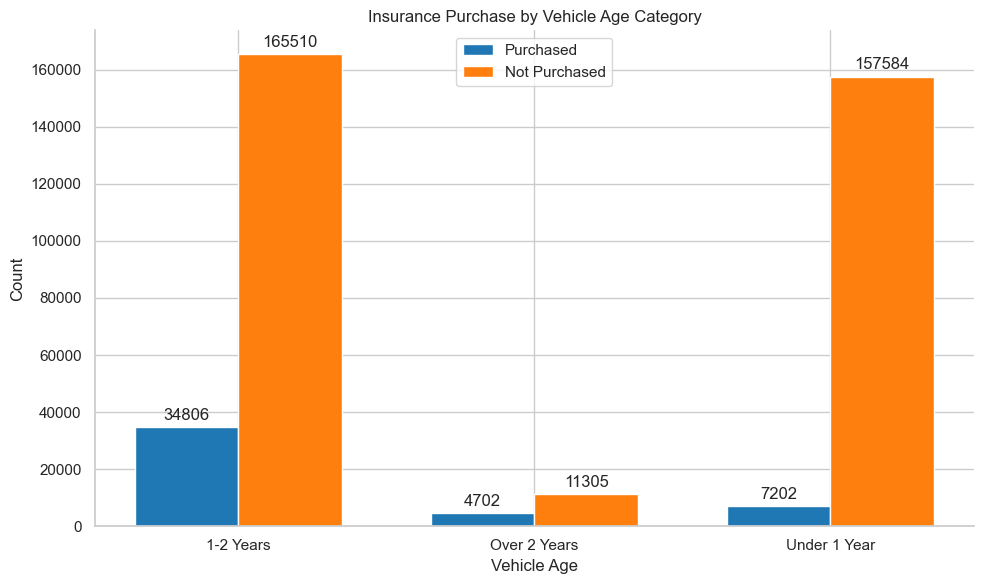
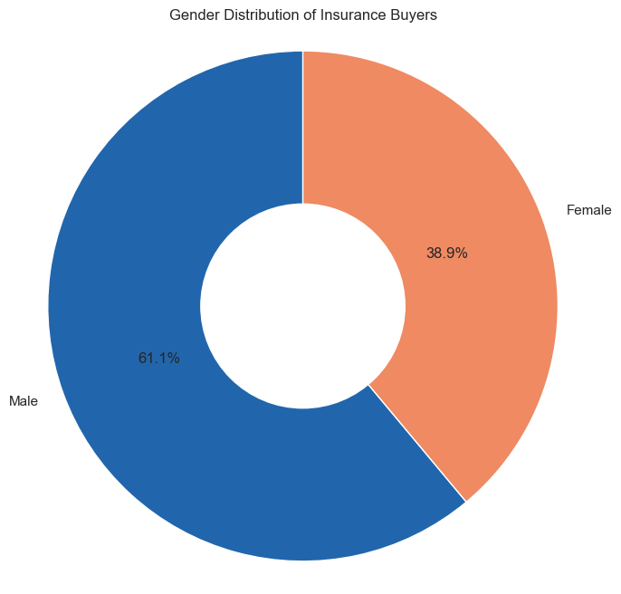

# 🚗 Acko General Insurance – Automating Intelligence with an ML Pipeline

## 🏢 The Backstory

In 2022, **Acko General Insurance**, one of India’s top digital insurers, was riding a wave of customer growth. Every day, thousands of people logged in, explored insurance options, and interacted with the platform. Their data — rich, real-time, and growing — lived inside **MongoDB Atlas**, constantly updating as customers engaged with the system.

But this raised a critical question:

> “How do we stay one step ahead of customer behavior — not just today, but every day going forward?”

The answer wasn't just a one-time analysis. What Acko needed was **a living, breathing machine learning system** — one that could evolve with their users, adapt to new patterns, and keep delivering accurate predictions *without anyone lifting a finger*.

---

## 🎯 The Mission

**My mission was clear:**  
Design and build a **fully automated, production-grade ML pipeline** that would:

- Tap into Acko’s live data stream
- Train powerful models to predict which users would buy insurance
- Keep improving over time — autonomously
- Deliver real-time predictions to power marketing, sales, and product decisions

---

## 🔧 The System I Built

This wasn’t just a Jupyter notebook project. It was a complete **MLOps architecture**, engineered for scale, speed, and self-sufficiency.

Here’s how it works:

### 🔄 1. Ingest Live Data from MongoDB

The system connects directly to **MongoDB Atlas**, pulling in the freshest customer data automatically.

> No CSVs. No exports. No manual refreshes.

---

### 🧹 2. Clean & Prepare the Data

Before any modeling happens, the pipeline runs a **data validation and transformation layer**:

- Cleans missing values
- Encodes categorical variables
- Scales and prepares features for modeling

It ensures every batch is model-ready — every single time.

---

### 🧠 3. Train Smart, Compare Smarter

Multiple models are trained (like Logistic Regression and XGBoost), with **GridSearchCV** used for tuning. But here’s the twist:

> The system doesn’t blindly accept the new model.

It compares new results against the **previous best** — using metrics like **ROC AUC**, **F1-score**, and **precision** — and **only** updates if performance improves.

---

### ☁️ 4. Save the Best to the Cloud

The winning model is pushed to **AWS S3**, versioned, and stored safely for production use.

No files on laptops. No local folders. It’s all cloud-native.

---

### 📦 5. Deploy Anywhere with Docker

Everything is containerized using **Docker**, meaning it can be run on a cloud server, local machine, or any CI/CD platform with just one command.

> One pipeline. One image. Infinite scalability.

---

## 🗂️ What's Inside

| 📁 Module | 🔍 What It Does |
|----------|----------------|
| `ingest.py` | Connects to MongoDB and fetches new data |
| `preprocess.py` | Cleans, validates, and transforms the data |
| `train.py` | Trains models and selects the best one |
| `evaluate.py` | Compares new model with last best model |
| `upload.py` | Pushes the model to AWS S3 |
| `Dockerfile` | Packages everything for deployment |

---

## 📸 Visual Tour

### 🔧 The Pipeline Architecture  

---

### 🚗 Who Buys Insurance After a Crash?  
Customers with past **vehicle damage** are far more likely to purchase insurance.  

---

### 🧓 Older Cars, Higher Conversions  
Customers with cars older than 2 years show higher buying intent.  

---

### 👱‍♂️ Gender-Based Patterns  
Slightly more male customers complete purchases — a signal worth exploring.  

---

## 🛠️ Tools That Made It Happen

| 🧰 Tool | 🔍 Why It Was Used |
|--------|--------------------|
| **MongoDB Atlas** | Real-time customer data source |
| **Pandas, NumPy** | Data manipulation |
| **Scikit-learn, XGBoost** | Modeling & evaluation |
| **AWS S3** | Cloud model storage |
| **Docker** | Scalable, portable deployment |
| **(Optional) MLflow** | Model tracking & versioning |

---

## 📘 Dive Deeper

Want to see how the system works in detail?

- 🧪 [View the Technical Documentation](mlops_vehicle_pipeline.txt)  
- 🚀 [Step-by-step Execution Guide](vehicle_insurance_mlops_project.txt)  
- 📊 [Data Analysis Notebook](notebook/Data_Analysis.ipynb)  
- 📈 [EDA & Model Selection Notebook](notebook/EDA+Model_Selection.ipynb)

---

## 🎯 The Business Wins

| 💡 Impact | 🚀 Value Delivered |
|----------|-------------------|
| 🎯 Higher Conversion | Focused outreach on high-intent users led to more sales |
| 💰 Budget Efficiency | Cut waste on cold leads with smarter targeting |
| 🔁 Full Automation | Engineers no longer needed for manual retraining |
| ⚡ Real-Time Insights | Sales and marketing operate with up-to-date predictions |

---

## 🙌 Final Thoughts

This wasn’t just a model. It was a **system** — a machine learning pipeline that thinks for itself, learns from data, and keeps improving. With this in place, Acko is no longer guessing who will buy insurance.

They're predicting it — automatically.

---

## 👨‍💻 About Me

**Built by Rishabh Parakh**  
A data professional passionate about solving real-world problems with smart, automated solutions.  
📬 [Connect on LinkedIn](http://www.linkedin.com/in/rishabh-parakh-4465031a0)

---
> **“Real intelligence isn’t about answers. It’s about asking the right questions — again and again, at scale.”**
