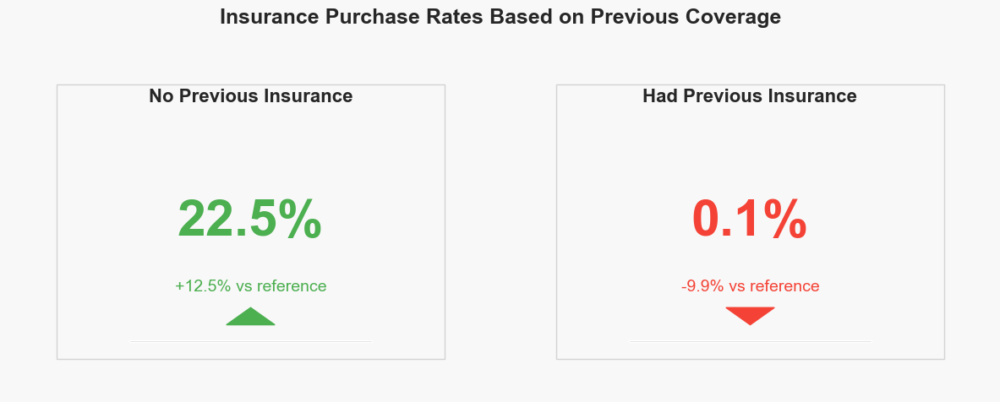

# 🚗 Acko General Insurance – Vehicle Insurance Purchase Prediction

Acko is a digital-first insurance company that offers vehicle insurance to customers across India. In this project, the goal was to understand customer behavior and predict who is most likely to purchase vehicle insurance based on their demographic and vehicle-related attributes.

The work involved analyzing historical data, identifying patterns, building a predictive model, and eventually creating a dynamic, production-ready pipeline that adapts to real-time data.

---

## 📁 Project Overview

This project consists of three key phases:

---

### 📊 Phase 1: Data Analysis — Understanding 2022 Customer Behavior

**Objective**  
Acko aimed to gain insights into customer behavior for the year 2022 to inform strategic decisions in product development, marketing, and customer engagement.

**Approach**  
I conducted a thorough analysis of the 2022 customer data, focusing on key variables such as gender, vehicle age, previous insurance status, and history of vehicle damage. The goal was to identify patterns that could inform business strategies.

**Key Insights**
- **Gender:** Male customers showed a higher likelihood of purchasing vehicle insurance.
- **Vehicle Age:** Owners of older vehicles (more than 2 years old) were more inclined to buy insurance.
- **Previous Insurance Status:** Customers who had not been previously insured demonstrated a stronger interest in purchasing insurance.
- **Vehicle Damage History:** Those with a history of vehicle damage were significantly more likely to purchase insurance.

### 📸 Visual Highlights from Phase 1

These visuals support the key behavioral insights discovered during the 2022 customer analysis:

- **Gender: Male customers showed a higher likelihood of purchasing insurance**  
  

- **Vehicle Damage History: Customers with previous damage were more likely to purchase**  
  

- **Vehicle Age: Older vehicles (>2 years) showed higher purchase rates**  
  

- **Previous Insurance Status: Uninsured customers showed strong buying interest**  
  

These findings provided valuable direction for Acko's teams to tailor their offerings and marketing strategies to better meet customer needs.

---

### 🤖 Phase 2: Predictive Modeling — Anticipating Customer Purchases

**Objective**  
After reviewing past customer behavior, Acko wanted to go a step further — by building a system that could predict which customers are likely to buy vehicle insurance in the future. The goal was to improve how leads are prioritized and campaigns are targeted.

**Approach**  
I used the cleaned customer data to identify the most relevant factors that influence purchase decisions — such as gender, vehicle condition, and insurance history. Using this, I developed and tested multiple models to find the one that could make the most accurate predictions.

**Outcome**  
A prediction model was built that could estimate the likelihood of each customer purchasing insurance. This gave Acko the ability to focus on high-potential leads, improving marketing efficiency and sales effectiveness across the business.

---

### 🚀 Phase 3: Building a Real-Time Prediction System — Automating the Process

**Objective**  
After analyzing past customer behavior (Phase 1) and developing a successful prediction model (Phase 2), the next step was to make the system automated and scalable. The company needed a way to keep predictions up-to-date as new customer data came in — without manual effort each time.

**Why This Was Needed**  
Acko receives new customer data regularly. If the model wasn't updated to learn from this new data, its predictions would become less accurate over time. The business needed a system that could continuously retrain itself, evaluate performance, and update only if it found a better version — like a smart self-improving assistant.

---

### 🔧 What Was Built

I developed a production-ready prediction pipeline — an end-to-end system that:
- Ingests new customer data automatically from the company’s live database (MongoDB).
- Prepares and cleans the data, making sure everything is in the right format for prediction.
- Evaluates the quality of the new data and performs checks before modeling.
- Trains a new model using the latest information.
- Compares the new model’s performance with the currently deployed one.
- Automatically updates the system if the new model is better — and saves it to a secure cloud location (AWS S3).
- Serves real-time predictions using a lightweight web application (via Flask), so teams can input customer details and instantly see the probability of purchase.

---

### 🎯 Business Impact

This phase turned the project from a one-time analysis into a living, breathing system that supports the business every day. Now, Acko can:
- Instantly assess which leads are most likely to convert.
- Make smarter marketing and sales decisions, backed by data.
- Avoid manual retraining and updates — the system handles that on its own.

In short, the model became operational, self-improving, and business-ready — helping Acko work faster, smarter, and with more confidence.
